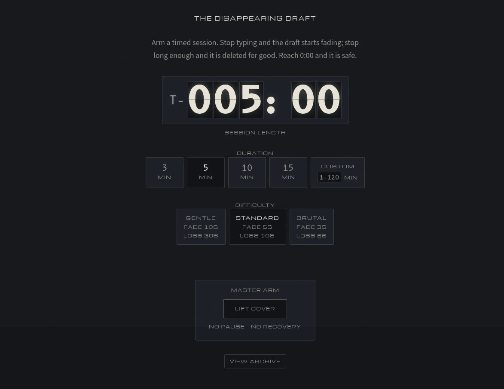
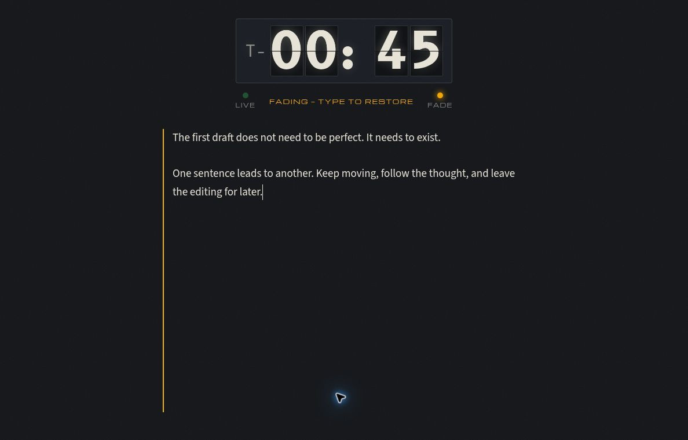
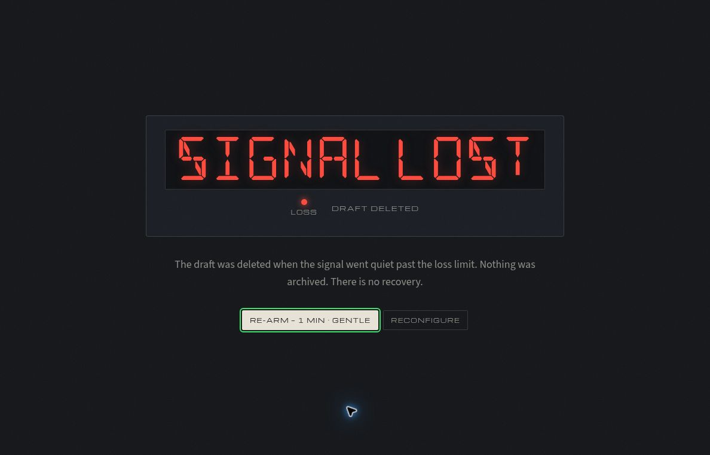

# The Disappearing Draft

**Set a timer. Keep writing. Bring the draft home before inactivity erases it.**

The Disappearing Draft is a browser writing experiment built around a real consequence: stop typing for too long during an armed session and the whole draft is deleted. Its mission-control interface turns a blank page into a short, focused challenge, with split-flap countdowns, warning lamps, and a guarded ARM control.

[Try the editor](https://draft.graydonwasil.com/) · [Run locally](#run-locally) · [Timing verification](docs/manual-verification-protocol.md)



*Choose the session before lifting the cover. The countdown does not begin until you arm it.*

> **The deletion mechanic is real.** There is no pause, undo, recycle bin, or cloud recovery for a lost session. Start with disposable writing. Do not use the armed editor as the only copy of work you cannot afford to lose.

## Your first session

1. **Choose a duration.** Pick 3, 5, 10, or 15 minutes, or enter a custom duration from 1 to 120 minutes.
2. **Choose a difficulty.** Each preset sets separate inactivity thresholds for warning and deletion.
3. **Lift the cover, then ARM.** This deliberate two-step control starts the session.
4. **Write until the session clock reaches zero.** Pausing your input starts the inactivity countdown. Resume text-changing input before the deletion threshold to restore the draft from its fading state. Returning focus or moving the cursor alone does not reset inactivity.
5. **Save what survives.** When time expires successfully, the threat disarms. Use the safe editing and export controls, and keep a copy outside the browser.

| Preset | Warning begins after | Draft is deleted after |
|---|---:|---:|
| **Gentle** | 10 seconds idle | 30 seconds idle |
| **Standard** | 5 seconds idle | 10 seconds idle |
| **Brutal** | 3 seconds idle | 6 seconds idle |

These are inactivity thresholds measured from your latest writing activity. The session duration is a separate countdown. Switching tabs does not pause either clock.

## The warning is part of the interface



*An actual Gentle session at 0:45 remaining, using disposable sample text. The amber lamp and explicit warning make the idle state visible.*

The editor fades the draft as a warning before the loss threshold. With reduced motion enabled, it uses a static warning and a numerical inactivity countdown instead of relying on the animated fade. Status announcements also communicate fade, deletion, and disarm through live regions.

The timer uses elapsed wall-clock time rather than assuming that every browser frame or interval ran on schedule. When a hidden tab returns, the engine reconciles the events in time order. If the session end and deletion boundary occur at exactly the same instant, the engine favors survival.

## If the signal is lost



*The loss screen states the outcome directly: nothing was archived and there is no recovery.*

A failed session never becomes an archive entry. **RE-ARM** immediately starts a fresh session using the last duration and difficulty; **RECONFIGURE** returns to setup so you can choose a different challenge. The remembered configuration does not contain the lost draft’s text.

This is intentionally a pressure-based writing tool. Gentle gives you more time, but it does not remove the deletion mechanic. If timed input is a poor fit for your workflow or access needs, use an editor that preserves drafts automatically.

## Keep a surviving draft

At zero, the successful route disarms the threat, attempts to save an archive snapshot, and gives you an editable, safe wind-down surface. **DONE** updates that same archive entry with your edits. Closing before DONE preserves only the disarm-time text if its initial save succeeded. If storage fails, the text stays available to copy or download, and DONE retries saving. Export work that matters before leaving. The **FLIGHT LOG**, reached through **VIEW ARCHIVE**, lets you revisit surviving entries and copy or download them as text files. It also provides per-entry deletion.

| Data | Where it lives | What to expect |
|---|---|---|
| Armed, in-progress text | Current browser session | It is not persisted as a recoverable draft. Reloading or leaving is not a save operation. |
| Surviving archive entries | Browser localStorage | Available in the same browser/origin while that storage remains intact |
| Last duration and difficulty | A separate localStorage key | Used for RE-ARM; contains configuration, not draft text |
| Downloaded `.txt` files | Your chosen download location | A copy independent of this website’s browser storage |

Clearing site data removes the browser archive. There is no account, cloud sync, server backup, or cross-device recovery. Copy and download are the backup workflow.

The storage keys are `the-disappearing-draft:archive` and `the-disappearing-draft:last-config`. The archive code quarantines corrupt payloads rather than silently overwriting them, but that is not a substitute for exporting work that matters.

## Controls and accessibility

| Control or feature | Behavior |
|---|---|
| Duration and difficulty choices | Pointer controls and keyboard radio-group navigation |
| LIFT COVER → ARM | Deliberate two-step start |
| Escape with the cover open | Close the cover before starting |
| RE-ARM | Begin again using the recalled configuration |
| RECONFIGURE | Return to setup |
| VIEW ARCHIVE | Open the Flight Log |
| Copy / Download | Export a surviving draft |
| Reduced-motion preference | Replace motion-heavy warnings with static, explicit feedback |

The interface includes timer semantics, live announcements, visible warning text, and contrast checks in its test suite. These measures improve access to the interface, but they do not eliminate the inherent difficulty of time-pressured deletion for some readers, writers, or input methods. There is no pause accommodation in the current product.

## Run locally

Use **Node 22.13+ within the 22.x line, or Node 24+** for the committed dependency set. The package declares `>=22.12`, but the locked dependencies require a newer 22.x patch; `.node-version` selects Node 22 for deployment.

```sh
git clone https://github.com/Arrangedgodly/writers-block.git
cd writers-block
npm ci
npm run dev
```

Open the local URL printed by Vite.

| Command | Purpose |
|---|---|
| `npm run dev` | Start the Vite development server |
| `npm test` | Run the Vitest suite once |
| `npm run build` | Run TypeScript’s no-emit type check, then build the site |
| `npm run preview` | Preview the built `dist/` output locally |

The production output is a static `dist/` directory with hashed assets. The existing deployment documentation describes the Cloudflare Pages setup for `draft.graydonwasil.com`; see [the deployment runbook](docs/DEPLOY.md) before changing hosting configuration.

## How it is built

| Layer | Implementation |
|---|---|
| Application | TypeScript with direct DOM rendering |
| Build | Vite; no UI framework |
| Session engine | Timing state machine, inactivity controller, and deletion/permanence handling |
| Persistence | Local browser archive and last-configuration modules |
| Testing | Vitest, jsdom, accessibility and contrast checks |
| Fonts | Bundled local typefaces, without runtime font CDN requests |

```text
src/engine/    timing, inactivity, and permanence behavior
src/data/      archive and last-configuration storage
src/ui/        setup, writing, outcomes, and Flight Log
src/styles/    shared tokens and surface styles
src/assets/    bundled fonts and licensing files
tests/         application smoke test
docs/          deployment and manual verification guidance
```

There is no application backend, sign-in flow, or telemetry service. Draft content is handled in the browser.

## Verify behavior, not just appearance

The automated tests cover timing boundaries, hidden-tab reconciliation, controller behavior, deletion, archive persistence, UI routing, and accessibility-related assertions. Test totals should come from the current run rather than a permanently copied count in this README.

Browser scheduling and native undo behavior also need real-browser checks. The [manual verification protocol](docs/manual-verification-protocol.md) contains step-by-step exercises and browser-specific result tables. Use disposable text when testing deletion, reloads, or storage behavior.

The screenshots above were captured from the live application with fictional sample text. They show setup, the fading warning, and a genuine loss outcome. The successful editing/archive route is described from the implementation; these images do not depict that route.

## Typography and licensing

The interface bundles B612 Mono, Michroma, Source Sans 3, and DSEG14 Classic. Font notices live alongside the source assets; deployment details describe how they are carried into the built output. The Source Sans subset uses the “Countdown Room Prose” name as documented by the project.

Preserve the included font notices and check each font’s supplied license before redistribution. The repository does not currently provide a general application `LICENSE` file.
